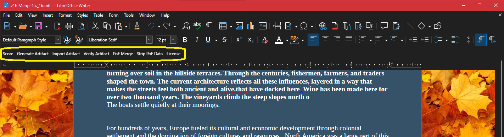
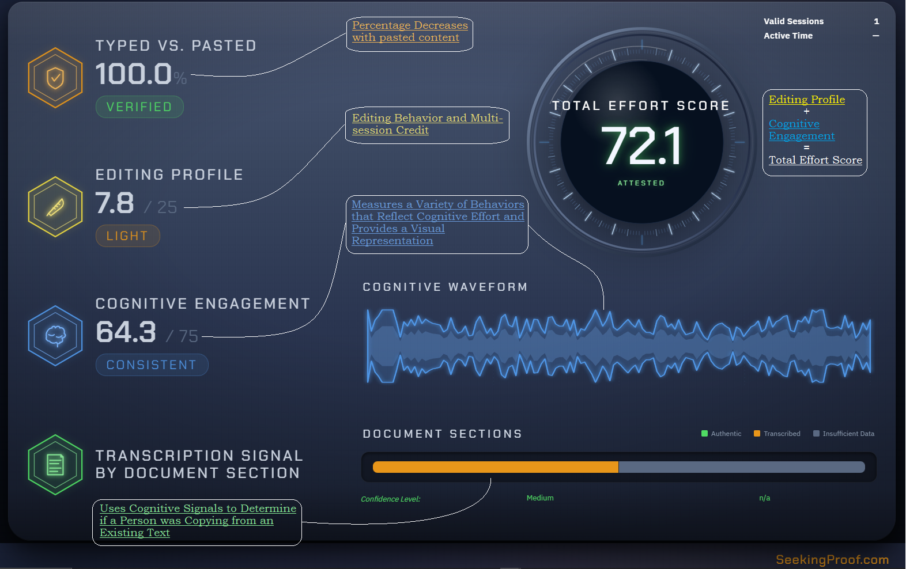
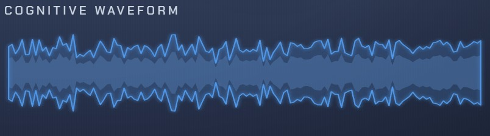

# Proof of Effort — User Guide

**for LibreOffice Writer  ·  Windows and macOS**
Khepri Humetric Solutions

*Write with confidence. **Prove** it's yours.*

Version 4 — Precise

---

# 1.  Welcome to Proof of Effort

Proof of Effort (PoE) is an add-on for LibreOffice Writer that quietly records the effort behind your writing as you work. When you're ready, it can turn that record into a sealed proof file you can share — evidence that your document was genuinely written by a person, not generated, dictated, or pasted in wholesale.

PoE is NOT detection software designed to "catch" bad behavior. It is a tool designed to protect the writer from accusations. It discloses what happened during a writing session by using your physical movements to measure distinct thinking (cognitive) signals that are made by humans as we work.

The ideal users are authentic writers seeking to keep a record of their honest effort during composition.

You don't have to do anything special to use it. Write the way you normally do; PoE keeps the record in the background. The buttons it adds simply let you score your work, create a proof, check a proof, or remove the record when you want to.

## What PoE does for you

- Records your writing effort automatically, with no change to how you write.
- Scores a document and shows how much of it was typed versus pasted.
- Creates a sealed proof file (a .poe file) you can hand to anyone.
- Lets anyone verify that a proof file is genuine and unaltered.
- Combines two versions of the same document — text and effort record together.
- Lets you remove the effort record from a file whenever you choose.

> **Your words stay yours.** PoE pays attention to how you write, not what you write. It does not keep a copy of your document's text, nor does it analyze the text.

## Installing PoE

**Before you install: set up LibreOffice**

Do these two things first — before installing PoE — so your writing is recorded cleanly from the start.

**1. Turn off autosave, but leave AutoRecovery on.**

Open Tools ▸ Options ▸ Load/Save ▸ General. Leave "Save AutoRecovery information every … minutes" checked, uncheck "Automatically save the document instead," and check "Always create backup copy."

AutoRecovery is not autosave. It keeps crash-recovery information without saving over your file, so it is safe to leave on. The actual autosave — "Automatically save the document instead" — is the one to turn off, so that closing a document without saving still discards an unwanted session.

**2. Turn off AutoComplete and Grammarly-type tools.**

In LibreOffice, turn off word completion under Tools ▸ AutoCorrect Options ▸ Word Completion, and disable any third-party writing assistant such as Grammarly. Text these tools insert on their own arrives without physical typing, so PoE records it as unverified and it can distort your cognitive signal. Ordinary AutoCorrect is fine — see "About Auto Complete, Grammarly and Voice to Text."

PoE installs like any other LibreOffice extension. You'll need the extension file for your computer (Windows or macOS) and your license key.

To install:

- In LibreOffice, open Tools ▸ Extension Manager.
- Click Add, choose the PoE extension file (it ends in .oxt), and accept the license when prompted.
- Quit LibreOffice completely and reopen it. On Windows, also close the LibreOffice Quick Starter icon in the system tray. On macOS, quit with ⌘Q so the program isn't left running in the background.
- On Windows, the first time PoE runs you may see a one-time permission prompt for its keyboard checker. This is expected — accept it.
- When asked, enter your license key. PoE is ready to use.

> **If the extension looks greyed-out.** If PoE appears inactive in the Extension Manager right after adding it, simply quit LibreOffice fully and reopen it. A complete restart activates the add-on. If you don't fully restart LibreOffice after installing PoE, the extension will not record your effort properly.

---

# 2.  Using PoE

PoE adds a small toolbar (and matching menu) to Writer with seven actions: Score Document, Generate Artifact, Verify Artifact, Import Artifact, PoE Merge, Strip PoE Data, and License. This section explains each one. First, a word on how the recording works.

## How the recording works

As soon as you open or start a document, PoE begins keeping a record of your writing activity. You never start or stop it by hand. The record lives inside the document file itself, so it travels with the document.

Two things are worth knowing up front, because they shape everything else:

- Saving is the moment that counts. When you save, the effort record for that work is sealed in. After that, it's part of the document's permanent history and can't be edited away.
- Before you save, you can walk it back. If something went wrong during a session — you pasted the wrong thing, or took a wrong turn — closing the document without saving discards that unsaved work and its record together.

You can score a document at any point, including before you save it. This lets you preview your result and decide whether to keep the work — by saving — or discard it by closing without saving.

> **A safety net for honest mistakes.** If you accidentally paste content or make a mess while drafting, just close without saving and reopen your last saved version. Save when you're confident; revert when you're not. Once you've saved, the cleanest way to start a record over is to begin again in a new document.

## Score Document

Scoring sends your document's effort record for analysis and shows you the result, including how much of the document was typed versus pasted (pre-existing content such as that in a template will also be counted as unverified. You or your institution must set acceptable use standards).

To score: open your document and click Score Document on the PoE toolbar. After a moment, a results window appears.

The results page shows several readouts drawn from the same record: the Typed vs Pasted "Verified" indicator, an overall effort score, an editing profile, a cognitive-engagement measure, and a transcription signal reported by document section.

On the results you'll see a Typed vs Pasted indicator labelled "Verified," with a percentage and color that reflects how much of the document was typed directly:

- Green — almost all typed.
- Blue — mostly typed.
- Amber — a noticeable amount was pasted or pre-existing text.
- Red — little of it was typed directly.

### What "transcription" means here

In PoE, transcription means copying text that already exists — reading from another source such as a printout, a second screen, a phone, or Ai-generated text, and typing it in — rather than composing it yourself as you go. It still takes real effort to type, but the writing behaviour differs from original composition, and that difference is what the transcription signal reflects. It is a measurement, not an accusation.

Text you typed and then copy/cut and paste was valid when you typed it and is considered valid after pasting. Only text that was copied and pasted from outside the document is considered unverified.

> **Two things to do before scoring.** You need an internet connection to score. Capture works offline, but scoring does not. If your document has tracked changes, accept or reject them first. Unresolved changes affect the character count and your Typed vs Pasted ratio.

You must have at least 30 seconds of typing activity to score. Measurement grows more reliable the more you write and revise. Because of this, transcription analysis results are displayed after about 600 words.

## The Cognitive Waveform

The Cognitive Waveform display is a representation of the signals PoE analyzes to verify human input patterns. It is provided to help you visualize the shape of your own cognitive signals during composition.

## Generate Artifact

There are situations, when you may prefer not to send a document with your behavioral data within it. Anyone who receives a file with PoE data can add content and more behavioral data. Because this data is tuned to general human patterns not individual patterns, it won't be possible to separate who wrote what. In order to give the writer more privacy and security, we have included the ability to separate the PoE data from the document, while keeping them mathematically linked.

An artifact is your sealed proof file. It ends in .poe and can be shared with anyone who needs to confirm your document was genuinely written.

To create one: open your document and click Generate Artifact. A Save PoE Artifact window appears; choose where to save the .poe file. PoE confirms the location when it's done.

Your document needs a PoE record to do this. If it has none — for example, a file created before PoE was installed — PoE will tell you there's no session data to seal.

> **Generate after you're finished.** Create the artifact once your writing is complete and saved. A cryptographic seal connects your .poe file to the content of the document.

## Import Artifact

If someone sends you a .poe proof file, Import Artifact loads it into PoE so you can review the scoring analysis.

To import: click Import Artifact and choose the .poe file from the Import PoE Artifact window.

## Verify Artifact

Verifying checks that a .poe proof file is genuine and hasn't been tampered with. Anyone can do this — the sender or the receiver.

To verify: click Verify Artifact, then choose the .poe file. PoE opens an Artifact Verification window with the result.

| What you'll see | What it means |
| --- | --- |
| Signature Valid: Yes | The proof file is authentic and unaltered. |
| Content Binding: Match | The open document matches the one the proof was made from. |
| Content Binding: Mismatch | No matching document is open (or it isn't saved). The proof's own seal is still checked. |

If you have the original document open while you verify, PoE can also confirm the proof still matches that document's words.

> **Formatting is fine; words matter.** Changing fonts, spacing, or styling in the document does not affect verification. Changing the actual words does — the proof is tied to the text you wrote.

## PoE Merge — combining documents

If you've worked on the same piece of writing across more than one file, PoE Merge brings them back together — both the text and the effort record. PoE Merge is its own tool — it does not use LibreOffice's Compare or Track Changes features. It combines both effort records and brings in only the words that differ between the two files, placing each one in line where it belongs so you can see exactly what changed.

### Which documents can be merged

PoE Merge only works on two versions of the same document — where one file was made from the other by saving a copy and then editing each separately. Because both copies still contain the earlier writing sessions they share, PoE can line them up and combine them.

Two documents that were each started from scratch cannot be merged, even if their text is similar or was copied between them. Copying and pasting text moves words, not the behavioral data, so the two files still have no shared history for PoE to match on.

- Works: You write a draft with PoE and save it, then use File ▸ Save As to make a second copy and edit both — at home or at work. Later, PoE Merge can bring them back together.
- Doesn't work: You open two new, blank documents and write in each one. They never shared a first session, so the merge stops with a "lineage mismatch" message.

### Making a copy the right way

Making a copy of a document you're still writing in? Use File ▸ Save As — don't copy the file in Windows Explorer or macOS Finder while it's open. Save As cleanly closes the current writing session before making the copy, so the original and the copy keep separate histories. Copying an open file instead duplicates an in-progress session shared between both documents; if you keep writing and later merge them, PoE keeps only one version of that session and the other's changes are lost. Copy files in your file manager only after they're finished and closed.

### To merge

- Open the version you want to keep as your main copy — the other one merges into this.
- Make sure both files contain PoE data.
- Click PoE Merge on the toolbar.
- In the Select Source Document for PoE Merge window, choose the other .odt file and confirm.
- PoE combines the two effort records and imports the words unique to the source, then tells you how many sessions were combined and how many passages it brought in.
- The imported words appear in salmon (a reddish colour), placed in line at the point where each change belongs — see Reading the changes below.

### Reading the changes

- Imported words appear in salmon (a reddish colour), placed in line at the point where each change belongs.
- Where the source reworded something you also have, its version sits in salmon next to yours. Keep whichever you prefer and delete the other — nothing is removed for you. When you have finished, select all text (Ctrl+A, or Cmd+A on Mac) and set Font Color back to Automatic to clear the highlight.

### Use PoE Merge, not LibreOffice's own merge

Only PoE Merge combines the effort records. LibreOffice's own Compare Document or Merge Document (under Edit ▸ Track Changes) will combine the text but not your PoE session data — any text it adds would then count as pasted from outside the document when you score. Always bring versions together with PoE Merge.

> **Review before scoring.** The salmon words are real, attributed writing and count normally, so your document is ready to score at any time. Deleting any reword versions you do not want, and clearing the salmon colour, is for your own readability — it does not change the score. If you see a "lineage mismatch" message, the two files aren't versions of the same original — you can still combine the text by hand, but only one document's PoE record will carry forward. Any additional text will be considered pasted from outside the document.

## Strip PoE Data

Strip PoE Data removes the effort record from a text document. Use it when you want a clean file with no PoE history.

Because this can't be undone, PoE asks twice: first a warning, then a final confirmation to proceed. Once stripped, the file can no longer be scored.

> **Make a backup first.** Stripping permanently removes the record. If you might need to score or prove the document later, save a separate copy before you strip. Capture stops while stripping and resumes for new writing afterward.

## The License Button

The License button on the PoE toolbar opens the License window, where you activate, review, or deactivate your license. The window shows one of three states:

- Free tier — no license active. Scoring, artifact import, and artifact verification remain available; recording and paid features are off. Enter a license code and click Activate to enable them.
- Active — your license is active. The window shows the days remaining and the expiry date. You can enter a different code here to replace the current license.
- Expired — your license has lapsed. Enter a new or renewed code to restore paid features.

**Activate.** Enter your license code and click Activate. The window refreshes to the Active state.

**Deactivate.** Click Deactivate to remove the license from this installation. The window returns to the free-tier state — scoring, import, and verification stay available, while recording and paid features stop. Deactivating frees the license so it can be activated on another computer.

> **Restart after activating or deactivating.** After you activate or deactivate a license, fully quit and restart LibreOffice so the change takes effect cleanly. On Windows, also close the Quick Starter icon in the system tray; on macOS, quit with ⌘Q.

*If you plan to move your license to another computer, deactivate it here first. Deactivating before uninstalling also prevents repeated license prompts on later restarts — see Troubleshooting.*

## About Auto Complete, Grammarly and Voice to Text

Proof of Effort is designed to verify that a human typed the text you see in a document. Tools that fill in text can conflict with PoE's stated purpose.

PoE documents real physical interactions. Text that appears without physical interaction cannot be verified by PoE. It is up to the writer to decide how to use additional writing tools and to disclose this use. Proof of Effort only documents what happened.

### Autocomplete vs Autocorrect

PoE allows for Autocorrection without flagging these changes as unverified. This is true for most Auto completed words as well, but excessive auto completed words can alter the rhythm of your typing compared to the actual text, which can lead to a lower cognitive rating and even create transcription signals.

It's best to turn off Autocomplete or simply accept the change to the scoring.

Autocorrect shouldn't cause any problems.

### Grammarly

Grammarly suggests and completes entire phrases and sentences. Phrases and sentences appearing in the document this way will almost certainly be considered unverifiable text and lower your Typed vs Pasted ratio, lower your effort score and possibly measure as transcribed. It is up to the writer to decide how much they are willing to allow for this.

### Voice to Text

PoE has not yet integrated voice to text compatibility. We are looking to include support for these assistive tools in upcoming releases.

Because VtoT programs create no physical interaction signals for PoE to measure, it cannot verify the human authorship of this content. Until we integrate support, we suggest you keep a recording of your dictation as evidence of your effort. Authentic writing is messy and filled with mistakes as well as changes of mind. Your vocal recording will document these same patterns and will serve as a good substitute for PoE data.

---

# 3.  Helpful Tips

### A note on what PoE measures

PoE measures effort — it documents the human interaction behind your writing, and that cognitive scoring is highly reliable; it simply records what happened as you worked. Because of that, PoE is best applied to higher-stakes writing: schoolwork, journalistic articles, legal documents, and refined social-media posts. As a rule, the lower the stakes, the lower the effort a piece takes — and the lower it tends to score.

Even transcribed writing is the result of real human effort — someone still sat and typed it — so a lower score is not an accusation. The one place the picture blurs is at the very bottom of the effort range, where very low-effort writing can be hard to separate from transcription, since both can look flat and linear. This resolves with length: the more you write and revise, the more reliable the measurement becomes, so PoE is at its most accurate on longer, developed documents rather than short or casual ones.

### Edit as you go

Revise while you write rather than saving all your changes for the end. Natural, ongoing editing is exactly the kind of authentic behaviour PoE recognizes, and it strengthens your record.

### Free-writing and journaling can look linear

Stream-of-consciousness writing — journaling, free-writing exercises — tends to be fast, forward-only, and lightly revised, which can resemble transcription. If you use PoE for this kind of writing, expect a lower or less certain reading; it is not a judgment on your work, just the shape of low-revision writing.

### Keep wireless keyboards charged or plugged in

Lower quality wireless keyboards or those with low power can create noise that interferes with PoE measurements. Keep wireless keyboards well charged or plugged in. If you have a buggy or low quality wireless keyboard, you may want to test it out a few times before relying on it, when using PoE.

---

# 4.  Troubleshooting

Common situations and what to do about them.

**The extension looks greyed-out or inactive after installing.**
Quit LibreOffice completely and reopen it. A full restart activates PoE.

**A button says "No document is open."**
Click into your document first, then use the button.

**Scoring won't finish.**
Check your internet connection — scoring needs to be online. Capture itself works offline.

**The result comes back as not scored, or "insufficient."**
The document is too short to score yet. Keep writing and try again. A minimum of 30 seconds of typing activity is required to score.

**A message says you've reached the scoring limit.**
There's an hourly limit on scoring attempts: 12x per hour with a 1hr lockout and 5x in any five minute period with a 15min lockout. This is done to prevent malicious spamming of the scoring engine. Wait and try again.

**After my computer woke from sleep, I saw "Your document may have changed."**
This is expected. Recording pauses while the computer sleeps, so the document may have changed while PoE wasn't watching. Review your work; the notice repeats every so often until recording resumes. To be safe, restart LibreOffice and continue writing.

**Recording doesn't seem to be happening.**
PoE rejects documenting most automated or injected keystrokes. Type on a real keyboard. If an automation tool was running, close and reopen LibreOffice to clear the block.

**Generate Artifact says there's no session data.**
The document has no PoE record — usually because it was created before PoE was installed. New writing in it will be recorded going forward. Pre-existing text will appear as Unverified.

**Merge stops with "lineage mismatch."**
The two files aren't versions of the same original document. Only a file and a copy made from it can be merged.

**Merge says a document has no PoE data.**
Either the document you're merging into, or the file you picked, has no PoE record. Both files need one.

**Verify says the document doesn't match.**
The document's words were changed after the proof was made, or the open document is not the one that sourced the .poe file. Re-create the proof from the current version if the changes are intended.

**Repeated license prompts after reinstalling.**
If you uninstalled PoE without deactivating your license first, then reinstalled, LibreOffice may show the license notification on every restart — even though clicking Activate pulls your stored license without asking you to re-enter it. Clicking OK lets recording proceed normally, but the prompt returns on the next restart. To avoid this, deactivate your license before uninstalling (open the License window and click Deactivate). If you're already in this state, deactivating and then reactivating your license clears it.

**On a Mac, LibreOffice closed unexpectedly right after I installed PoE.**
Quit fully with ⌘Q and reopen, rather than using an in-app restart immediately after installing. It won't recur once you've reopened cleanly.

**Windows showed a permission prompt the first time.**
That's PoE's keyboard checker asking for a one-time permission. It's expected and safe to accept.

---

# 5.  Frequently Asked Questions

Plain answers about what PoE is, what it isn't, and how it works.

**What is Proof of Effort?**
It's a tool that attests a document was genuinely written by a person, through real typing effort — and turns that into a sealed proof file you can share.

**How does it work, in plain terms?**
While you write, PoE measures your movement patterns not the text or specific timing between keystrokes. The data kept is NON-Biometric and cannot be used to identify you. When you're ready, it scores that record and can seal it into a proof file within your document or separately. Anyone can then check that the proof is genuine and unchanged — all without PoE keeping a copy of your actual words or any unique profiles that can be associated with an individual.

**Does PoE read or store my writing?**
No. PoE looks at how you write, not what you write. It does not keep the text of your document. To link a proof to a document, it uses a one-way fingerprint of the text, not the text itself.

**Is this a biometric or identity check? Does it know who I am?**
No. PoE doesn't identify you and isn't a fingerprint, face, or identity system. It attests that human writing effort took place — not whose it was. Think of it as the difference between a detailed photo of your face (biometric) vs a rough shadow you cast on the ground (non-biometric). One is distinctly you, the other is distinctly human.

**Is PoE an "Ai detector"?**
Not at all. PoE doesn't judge your content or guess whether a machine wrote it. It documents what actually happened while the document was made — for example, how much was typed versus pasted — and lets that speak for itself. PoE provides the record, humans provide the judgment.

**Is PoE watching everything I do on my computer?**
No. PoE only pays attention to your writing activity in the document you're working on, while you're working on it. It does not have the ability to monitor or consume anything outside your word processor.

**Do I need to be online?**
Only to score a document or import artifacts. The background recording works whether you're online or not.

**What happens if I paste text?**
Pasting is allowed and simply recorded. Pasted passages show up in the Typed vs Pasted result, and large amounts will lower how much of the document reads as typed.

If you move or paste text you already typed in, PoE will not count this against you. Only pasted content that came from outside the document is considered unverified. Pre-existing text, such as when using templates, is also considered unverified. Make sure to disclose pasted or template content.

**What if I use a template?**
It's perfectly fine to use templates; however, be advised that templates you created before PoE or downloaded from elsewhere have no PoE session data. Once you start writing in a template with PoE installed, only the new text you typed will be verified. This is perfectly fine. PoE only discloses, it doesn't judge. You or your institution should set a clear policy concerning templates.

**Can I undo a mistake?**
Before you save, yes — close the document without saving and your unsaved work and its record are discarded together. After you save, the record is sealed. To start fresh, begin again in a new document. This counts for pasted content and transcription patterns. Deleting text does NOT remove the cognitive record.

**Will changing my document break its proof?**
Changing formatting, fonts, or styling does not. Changing the words does, because the proof is mathematically tied to the text you wrote. If you revise the words, make a new proof.

**What is the "Verified" indicator?**
It's the Typed vs Pasted result. The percentage and color — green, blue, amber, or red — shows at a glance how much of the document was typed directly rather than pasted in.

**Who can verify my proof?**
Anyone with the .poe file. Verifying confirms the proof is genuine and unaltered, and — if they also have your document — that it still matches.

**Is my privacy protected?**
PoE doesn't keep the words you write; scoring uses only a mathematical representation of writing activity, never your text or identity. For full details, see the privacy policy at SeekingProof.com.

**Can I convert Libre ODT files into MS Word DOCX and keep my effort data?**
File conversion is not currently supported, but it's in the mail. Luckily, LibreOffice is free, so anyone can install and verify your work.

---

*Khepri Humetric Solutions  ·  SeekingProof.com  ·  Patent Pending*
